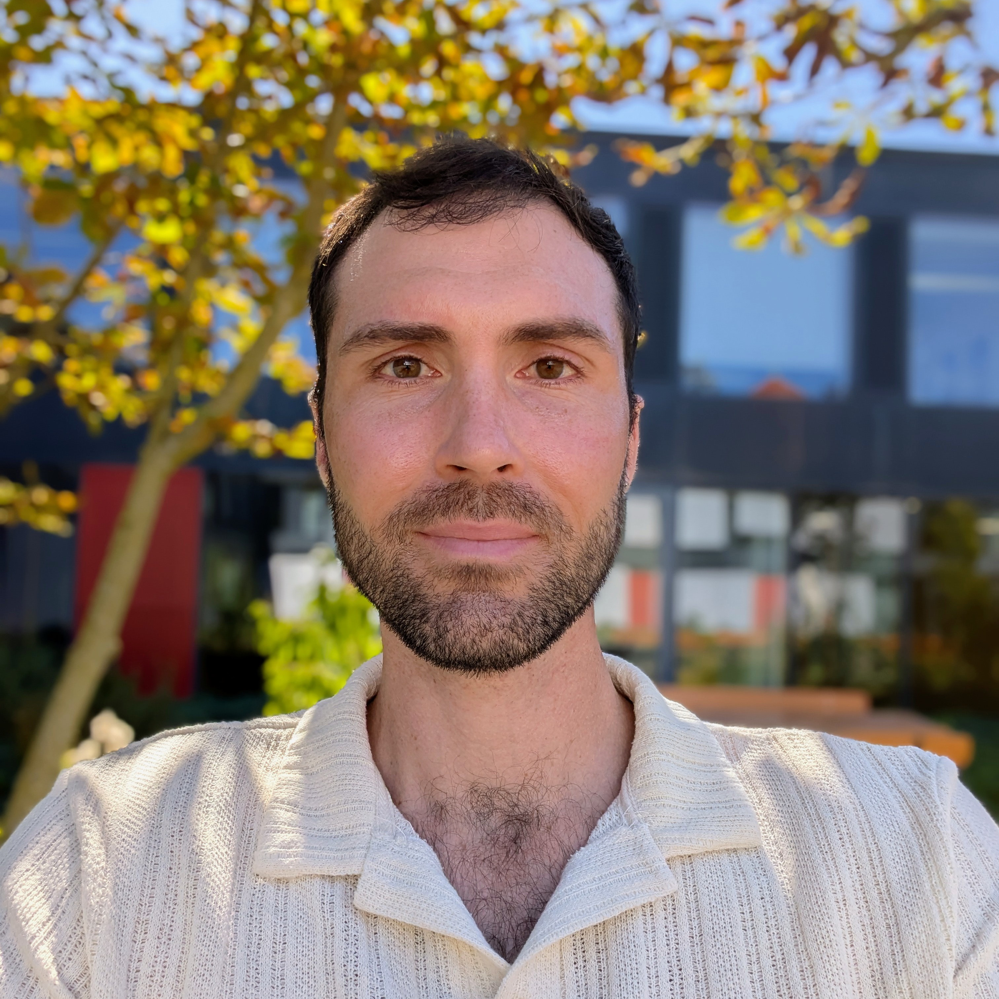

## About Me

Hi!

I'm a doctoral researcher working at the intersection of the history of science and media studies. My research focuses on the history of the humanities and cultural studies, drawing on media theory, historical epistemology, and science and technology studies.

Particular interests include media-based techniques and practices of knowledge production, as well as questions of extractivism, material provenance, and the global infrastructures of resource regimes.

I'm a PhD candidate in the [DFG project "Raw Materials of the Humanities"](https://rohstoffe-der-geisteswissenschaften.de/en/home-english/) at the Humboldt-Universität zu Berlin and Doctoral student of the [International Max Planck Research School “Knowledge and Its Resources”](https://imprs.mpiwg-berlin.mpg.de) at the Max Planck Institute for the History of Science.

## Dissertation Project
**Nitrocellulose: A Material and Media History of the Humanities**

My PhD project investigates nitrocellulose and its significance for the history of the humanities in the 19th and 20th centuries. I focus on the material resources collodion and celluloid, both products of nitrocellulose, which played pivotal roles in shaping media technologies including photographic processes and cinematography. Through case studies, the project addresses working practices and knowledge techniques in the humanities, such as the application of the collodion wet plate process in archaeological photography or the production of educational films in the field of cultural history.

Of interest are, first, the working practices of humanities scholars as they engaged with these materials, revealing how the material properties of collodion and celluloid were inscribed into the production, transfer, and storage of knowledge within the humanities. My second focus is on the raw materials of nitrocellulose-based media technologies themselves—cotton, saltpeter, camphor.

The project examines the extraction, transportation, and processing of raw materials, tracing the ecological, economic, political, and industrial contexts through which they were transformed into media of knowledge. By situating the media practices of the humanities and the emergence of humanities disciplines within the broader material history of nitrocellulose, the project highlights how these processes were embedded in global networks shaped by ecological, economic, and colonial power structures. These intricate networks are themselves resources that, I argue, have been of great importance to the epistemes of the humanities.
